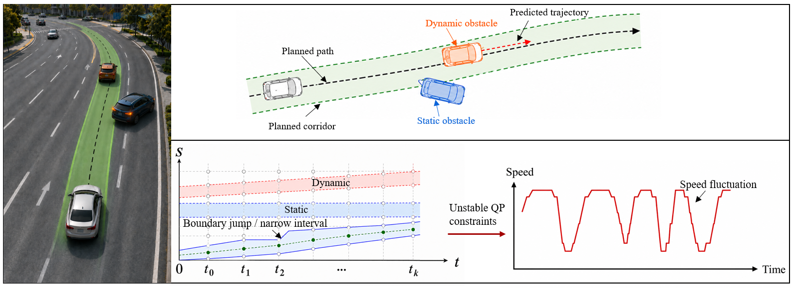
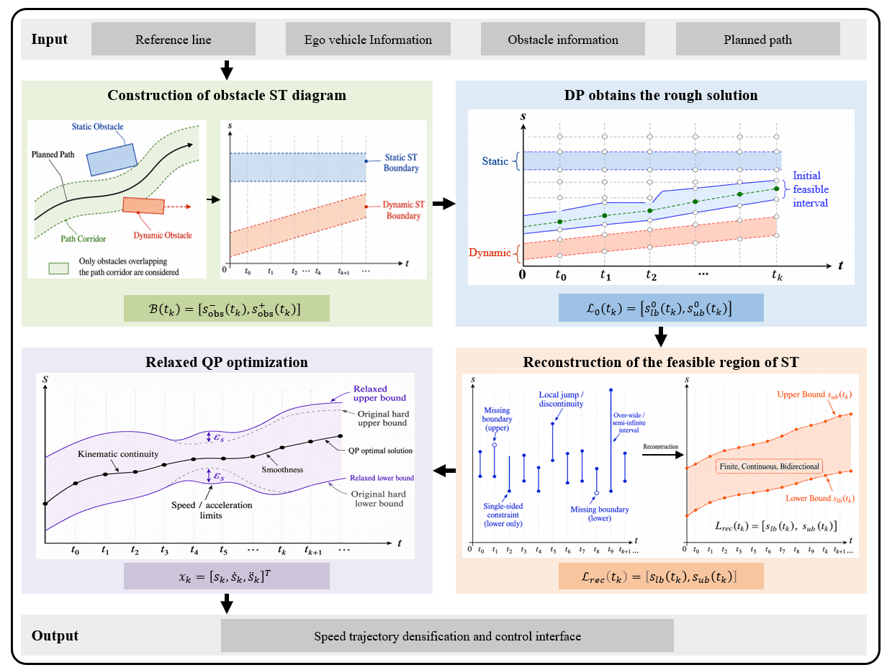
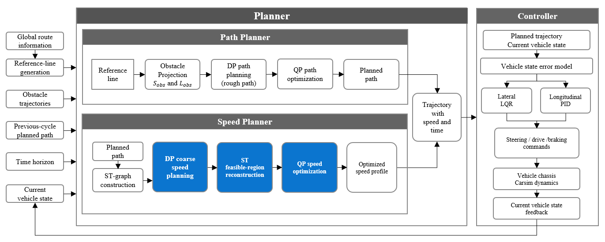

# Continuous Bidirectional ST Feasible Region Reconstruction for Autonomous Driving Speed Planning

## Overview

This repository presents a continuous bidirectional ST (Space-Time)
feasible region reconstruction method and robust QP-based speed planning
framework for autonomous driving.

The method focuses on solving the instability problems of traditional
DP-QP speed planners:

-   ST boundary discontinuity
-   One-sided feasible constraints
-   Local feasible region degeneration
-   QP infeasibility under dynamic obstacles
-   Velocity oscillation and poor smoothness

The proposed framework reconstructs the original discrete ST feasible
region into a finite, continuous and bidirectional feasible corridor,
and then performs relaxed QP optimization to generate smooth and
executable speed trajectories.

------------------------------------------------------------------------

## Framework

The framework contains:

1.  Obstacle ST graph construction
2.  DP rough speed search
3.  Continuous bidirectional ST feasible region reconstruction
4.  Relaxed QP speed optimization

------------------------------------------------------------------------

## Method

### ST Feasible Region Reconstruction

The reconstruction module includes:

-   Boundary validity detection
-   Missing boundary completion
-   Local width restoration
-   Acceleration-constrained reference correction
-   Safety projection

The reconstructed ST corridor provides stable upper and lower
longitudinal constraints for QP optimization.

------------------------------------------------------------------------

### Relaxed QP Speed Optimization

The optimization considers:

-   Reference velocity tracking
-   DP trajectory consistency
-   Acceleration smoothness
-   Jerk minimization
-   Relaxation penalty

The bounded relaxation variables improve numerical robustness while
maintaining obstacle safety constraints.

------------------------------------------------------------------------

## Simulation Platform

The validation platform is built with:

-   MATLAB/Simulink
-   CarSim vehicle dynamics
-   Planning module
-   Control module
-   Closed-loop vehicle feedback

Simulation parameters:

  Parameter            Value
  -------------------- ---------
  Planning frequency   10 Hz
  Control frequency    100 Hz
  CarSim integration   1000 Hz
  Prediction horizon   8 s
  ST resolution        0.1 s

------------------------------------------------------------------------

## Test Scenarios

Four scenarios are evaluated:

1.  Single static obstacle avoidance
2.  Close static obstacle
3.  Dynamic obstacle avoidance
4.  Mixed static-dynamic obstacles

------------------------------------------------------------------------

## Results

The proposed method improves:

-   ST feasible region continuity
-   Boundary completeness
-   QP optimization stability
-   Speed smoothness
-   Closed-loop executability

Compared with the original DP-QP method:

-   Effective bidirectional feasible nodes increase significantly
-   Boundary jumps are reduced
-   Vehicle speed efficiency improves
-   Jerk and acceleration fluctuation decrease

------------------------------------------------------------------------

## Repository Structure

    ST-Reconstruction
    |
    ├── README.md
    ├── figures
    │   ├── figure_1.png
    │   ├── figure_2.png
    │   └── figure_3.png
    │   ├── figure_4.png
    │   ├── figure_5.png
    │   └── figure_6.png
    └── Simulink

------------------------------------------------------------------------

## Requirements

-   MATLAB R2023b+
-   Simulink
-   CarSim
-   Optimization Toolbox

------------------------------------------------------------------------

## Citation

    Continuous Bidirectional ST Feasible Region Reconstruction and Closed-loop Speed Planning Method

